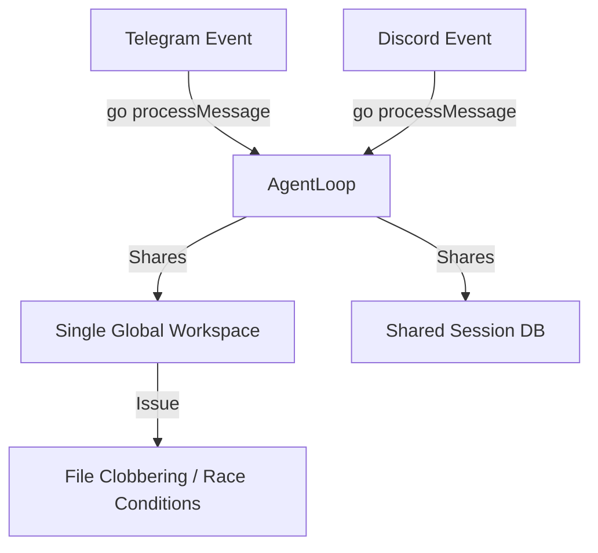
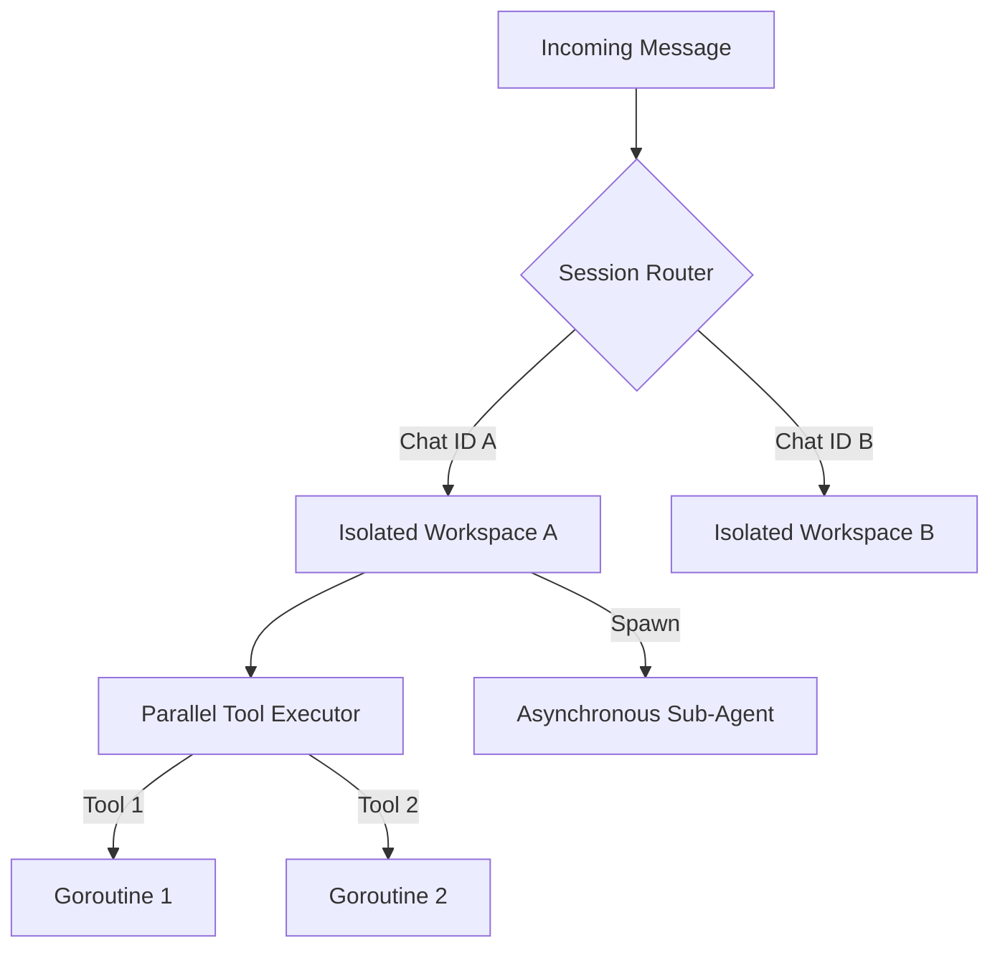

# Picobot Multitasking Architecture Design

This document outlines how to transition Picobot from a shared single-tenant agent to a robust, multitasking, multi-tenant agent system.

---

## 1. Current Multitasking State & Limitations

While the main loop in `loop.go` uses goroutines (`go a.processMessage(ctx, msg)`) to handle incoming events without blocking the chat queue, it has critical bottlenecks:



### Key Limitations:
1. **Workspace Collision**: Any concurrent runs read/write files (such as `PLAN.md`, temporary scripts, and data files) in the same directory. Running two tasks concurrently will clobber files.
2. **Sequential Tool Execution**: Multiple tool calls requested by the model in a single turn (e.g., fetching multiple websites or writing multiple files) are executed one after the other.
3. **Session Context Overlap**: If a user sends multiple messages rapidly, they will read and write the same chat history file concurrently, causing history corruption.

---

## 2. Proposed Multitasking Enhancements

To give Picobot true multi-tasking capability, we implement three core improvements:



---

## 3. Implementation Steps

### Step 1: Workspace & Session Isolation (Multi-Tenancy)
Instead of anchoring all filesystem tools and sessions to a single root directory, dynamically isolate them by `channel` and `chatID`:

1. Update `AgentLoop.processMessage` to create/resolve a tenant-specific workspace path:
   ```go
   tenantWorkspace := filepath.Join(a.workspace, "tenants", msg.Channel, msg.ChatID)
   if err := os.MkdirAll(tenantWorkspace, 0755); err != nil { ... }
   ```
2. Instantiated tools (like `FilesystemTool` and `ExecTool`) must be created dynamically *per message context* (or their roots must be dynamically re-anchored based on the context's channel and chat ID).
3. Ensure that when a tenant workspace is initialized, base templates (`SOUL.md`, `USER.md`, `TOOLS.md`) are copied or symlinked so the model retains its guidelines.

### Step 2: Parallel Tool Execution
When the LLM requests multiple tool calls in a single response, execute them concurrently using Go's concurrency primitives:

```go
// Replace the sequential loop in loop.go with concurrent execution
var wg sync.WaitGroup
results := make([]struct {
    tcID   string
    result string
    err    error
}, len(resp.ToolCalls))

for i, tc := range resp.ToolCalls {
    wg.Add(1)
    go func(idx int, call providers.ToolCall) {
        defer wg.Done()
        // Run the plan guard check
        if err := a.checkPlanGuard(call.Name, call.Arguments); err != nil {
            results[idx] = struct{ tcID, result string; err error }{call.ID, "(tool error) " + err.Error(), err}
            return
        }
        res, err := a.tools.Execute(toolCtx, call.Name, call.Arguments)
        results[idx] = struct{ tcID, result string; err error }{call.ID, res, err}
    }(i, tc)
}
wg.Wait()

// Append results back to messages in the correct order
for _, r := range results {
    messages = append(messages, providers.Message{Role: "tool", Content: r.result, ToolCallID: r.tcID})
}
```

### Step 3: Implement the `spawn` Tool for Asynchronous Subagents
Activate the stubbed `spawn` tool to run tasks in the background:

1. **Tool Definition**:
   ```json
   {
     "name": "spawn",
     "description": "Spawn a background subagent to solve a sub-task concurrently. Returns immediately with a task ID.",
     "parameters": {
       "type": "object",
       "properties": {
         "task_name": {"type": "string", "description": "Short name for the subagent's workspace"},
         "objective": {"type": "string", "description": "The exact objective the subagent needs to achieve"}
       },
       "required": ["task_name", "objective"]
     }
   }
   ```
2. **Execution Handler**:
   - The tool creates a sub-workspace: `workspace/subagents/<task_name>/`.
   - Starts a background goroutine with a fresh `AgentLoop` anchored at that sub-workspace.
   - The subagent creates its own `PLAN.md` and works autonomously.
   - When finished, the subagent writes `result.txt` and calls the parent channel to notify the user/parent: *"Task <task_name> completed. Result: <summary>"*.
